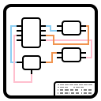
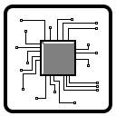
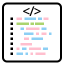

### Hi there, I'm [xianii](https://nigh.github.io) 👋

<h3 align="center">Tech Stack</h3>

    
    
Design

    
    
Layout

    
    
Programming

<h3 align="center">Work on</h3>

    
    
ARM

    
    
Arduino

    
    
RaspberryPi

    
    
LÖVE

<h3 align="center">Language</h3>

    
    
c

    
    
lua

    
    
autohotkey

